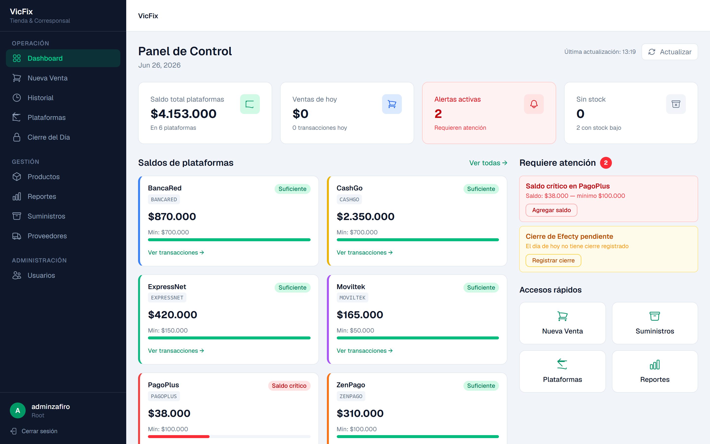
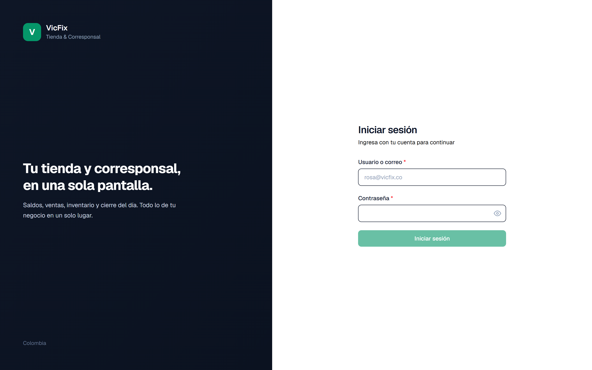
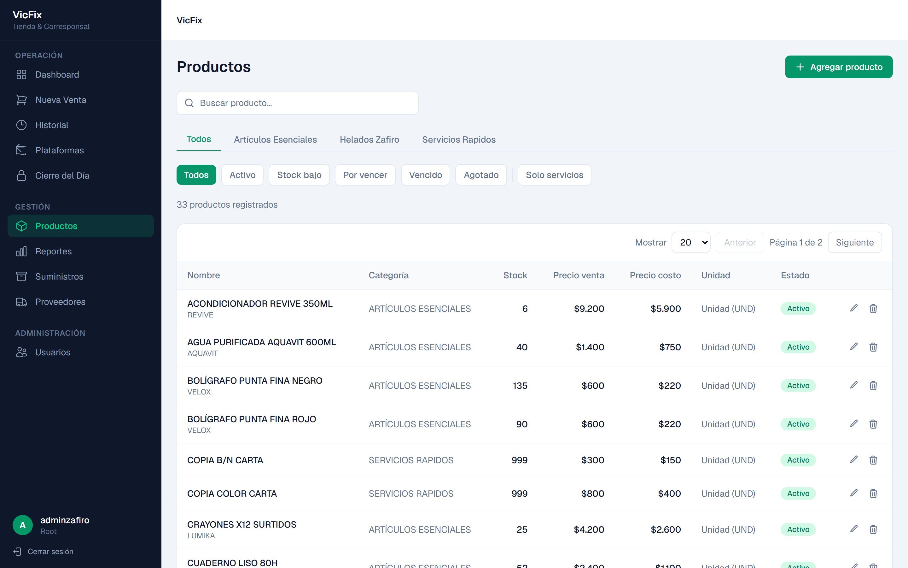
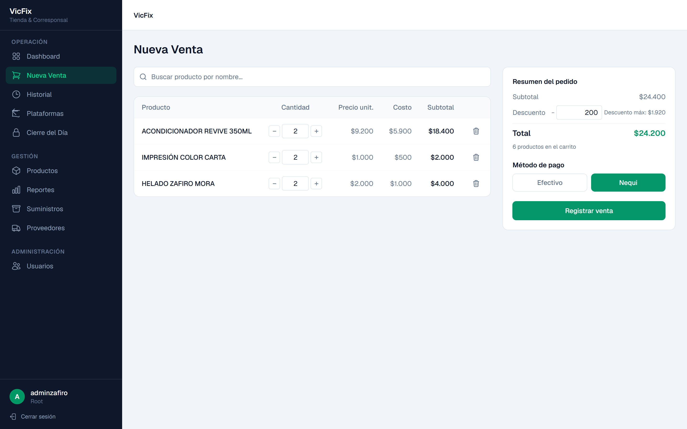
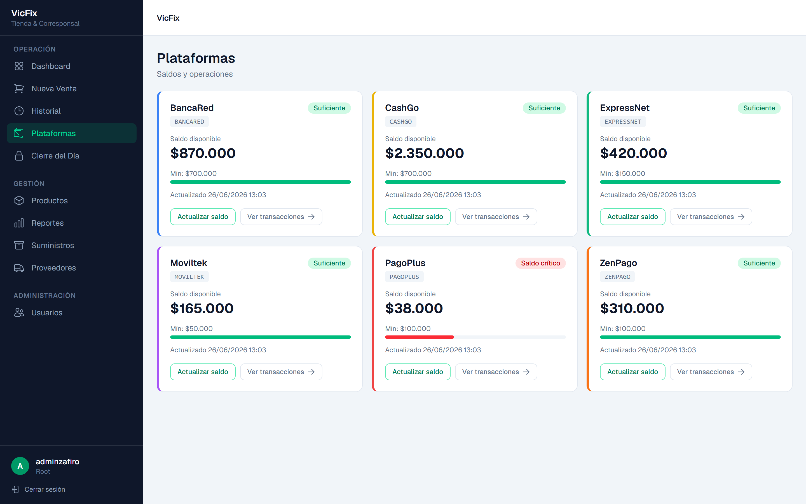
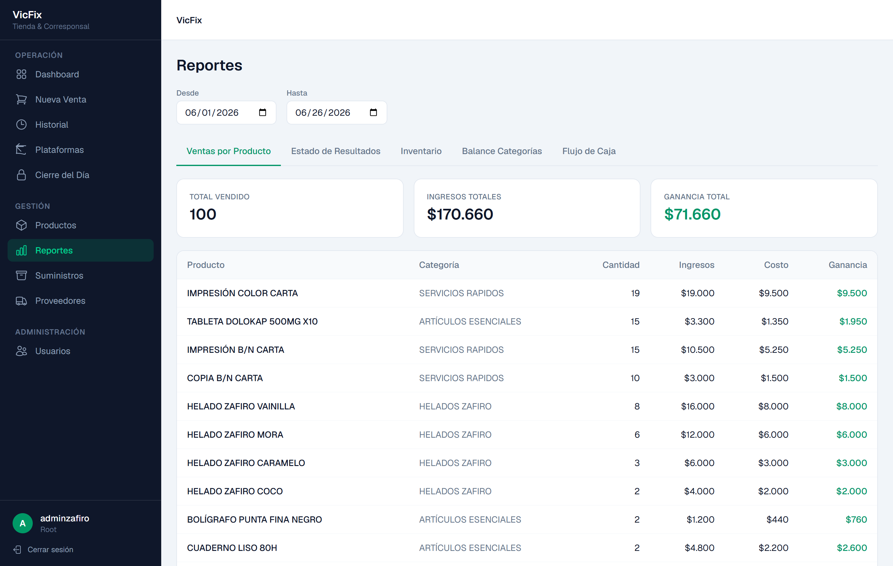
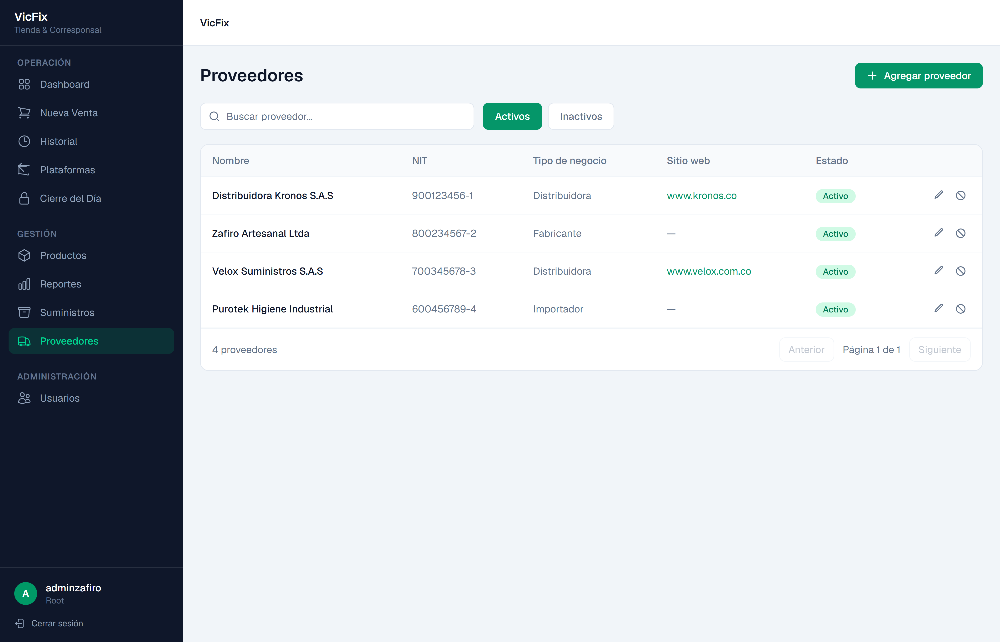
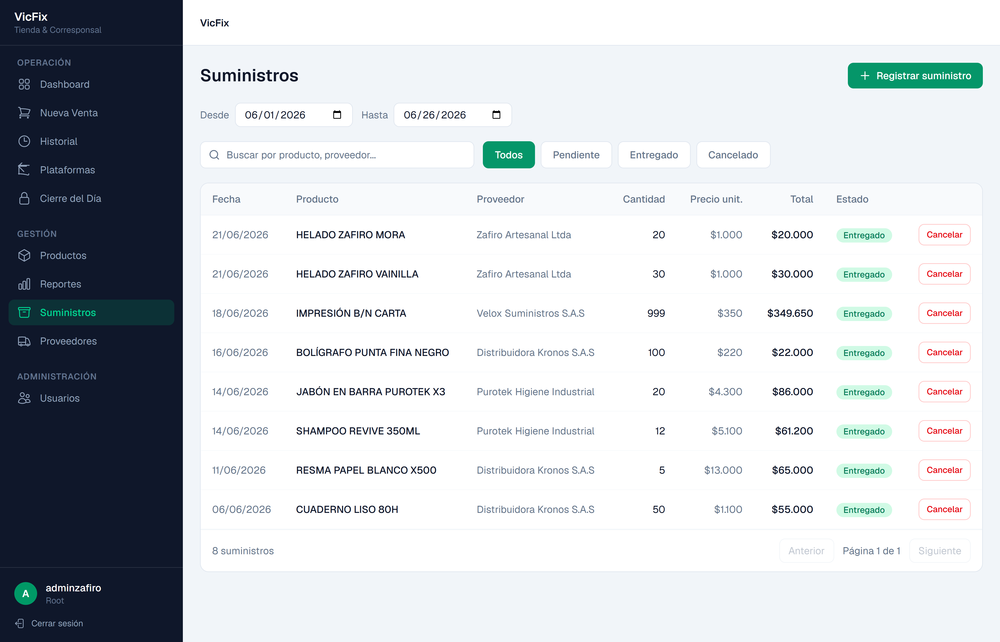
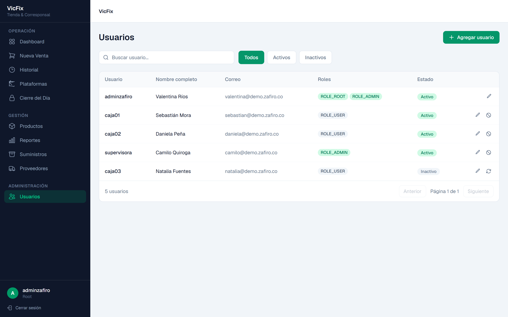
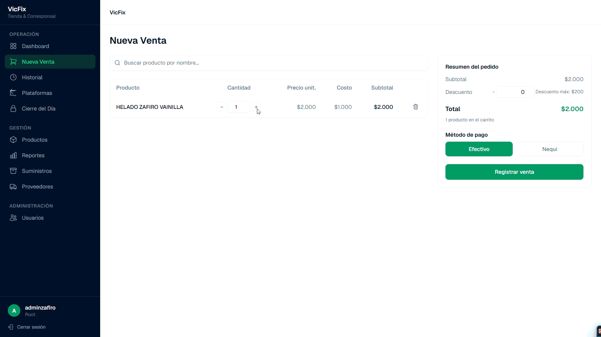

# VicFix — Frontend

> Sistema de gestión integral para tienda y corresponsal bancario.

[](https://angular.dev)
[](https://tailwindcss.com)
[](https://typescriptlang.org)
[](https://www.vicfix.shop)

---

## Vista general



VicFix centraliza en una sola pantalla todo lo que necesita el cajero de un negocio familiar con dos operaciones simultáneas:

**Tienda** — inventario de productos con categorías, punto de venta POS, historial de ventas y reportes de ganancias.

**Corresponsal bancario** — seguimiento de saldos en tiempo real para múltiples plataformas, registro de cierres y alertas de saldo crítico.

El flujo crítico: cuando un cliente pide retirar $200.000, el cajero necesita saber en menos de 2 segundos si hay efectivo en caja y saldo en la plataforma. El Dashboard resuelve eso de un vistazo.

**Demo en vivo:** [`https://www.vicfix.shop`](https://www.vicfix.shop)

---

## Pantallas

### Login



### Panel de Control


KPIs en tiempo real: saldo total de plataformas, ventas del día, alertas activas y productos sin stock. Las tarjetas de plataformas muestran barra de progreso coloreada (rojo = saldo crítico, verde = suficiente) y accesos rápidos a Nueva Venta, Suministros, Plataformas y Reportes.

### Productos



Filtros por categoría y estado (Activo, Stock bajo, Por vencer, Vencido, Agotado, Solo servicios). Buscador en tiempo real, paginación y acciones de editar/eliminar por fila.

### Nueva Venta — POS



Buscador con autocompletado que muestra stock disponible, carrito editable con controles `−/+`, cálculo automático de subtotal y descuento máximo, selección de método de pago (Efectivo / Nequi) y botón "Registrar venta".

### Plataformas Bancarias



Vista de las plataformas con saldo disponible, mínimo configurado, barra visual de estado y acceso directo al historial de transacciones.

### Reportes



Cinco tabs: Ventas por Producto, Estado de Resultados, Inventario, Balance por Categorías y Flujo de Caja. Filtro por rango de fechas.

### Proveedores



### Suministros



### Usuarios y Roles



---

## Flujo — Nueva Venta



Buscar producto → agregar al carrito → ajustar cantidad → seleccionar método de pago → registrar venta.

---

## Stack técnico

| Capa | Tecnología |
| ------ | ----------- |
| Framework | Angular 21.2 — standalone components, zoneless |
| Estilos | Tailwind CSS 4.3 |
| Lenguaje | TypeScript 5.9 (strict mode) |
| Estado reactivo | Signals (writable, computed, effect) + `rxResource` |
| HTTP | `HttpClient` + interceptors JWT |
| Tipografía | Geist |
| Testing | Vitest |
| Backend | Spring Boot 3.4.4 + Java 21 → `https://app.vicfix.shop` |

---

## Decisiones de arquitectura

**Signals en lugar de NgRx** — no hay librería de estado global; signals + services son suficientes para la escala de esta app.

**Zoneless** — Angular 21 con detección de cambios 100% por signals, sin Zone.js.

**JWT en memoria** — access token nunca se escribe en `localStorage`; el refresh token vive únicamente en una cookie httpOnly.

**RBAC** — los permisos fluyen a través de roles (`ROLE_ROOT`, `ROLE_ADMIN`, `ROLE_USER`), no directamente a usuarios.

**Lazy loading** — cada ruta de feature se carga de forma diferida.

**`rxResource`** — usado para la búsqueda reactiva en Nueva Venta: el query signal dispara automáticamente el refetch sin código extra.

**`CurrencyCopPipe`** — pipe centralizado que formatea pesos colombianos como `$251.000` (punto como separador de miles, sin decimales).

---

## Estructura del proyecto

``` md
src/app/
├── auth/
│   ├── login/              # LoginComponent
│   ├── auth-api.ts         # AuthService (token en memoria, session restore)
│   ├── auth.guard.ts       # authGuard + guestGuard
│   ├── auth.interceptor.ts # Bearer token injection
│   └── auth.models.ts      # LoginResponse, User, LoginResult
├── shared/
│   ├── layout/shell/       # Shell: sidebar + header + router-outlet
│   ├── pipes/              # CurrencyCopPipe
│   ├── ui/modal/           # ModalComponent reutilizable
│   └── models/             # Product, Page, etc.
└── features/
    ├── products/            # Lista + CRUD modal
    ├── sales/               # POS + historial
    ├── suppliers/           # Proveedores
    ├── users/               # Usuarios + roles
    ├── reports/             # Cinco tabs de reportes
    ├── dashboard/           # Panel de control
    ├── platforms/           # Corresponsal bancario
    └── close/               # Cierre del Día
```

---

## Instalación y desarrollo

**Requisitos:** Node 22+, Angular CLI 21.

```bash
git clone https://github.com/<tu-usuario>/vicfix-frontend.git
cd vicfix-frontend
npm install
ng serve --port 4200
```

El backend debe estar corriendo localmente, o apunta `src/environments/environment.ts` directamente a la API de producción en `https://app.vicfix.shop`.

---

## Variables de entorno

```typescript
// src/environments/environment.ts
export const environment = {
  production: false,
  apiUrl: 'http://localhost:8081'
};

// src/environments/environment.production.ts
export const environment = {
  production: true,
  apiUrl: 'https://app.vicfix.shop'
};
```

---

## Deploy en Vercel

Conecta el repositorio a Vercel con esta configuración:

| Setting | Value |
| --------- | ------- |
| Framework preset | Other |
| Build command | `npm run build` |
| Output directory | `dist/vicfix-frontend/browser` |
| Install command | `npm install` |

`vercel.json` maneja el routing SPA — no se necesita `HashLocationStrategy`.

---

## Convenciones de commits

``` md
feat: add login page with JWT auth
fix: correct currency format in product list
refactor: extract product card to shared component
chore: update Angular dependencies
style: align dashboard cards
test: add product service unit tests
```

---

*Hecho con ♥ en Colombia.*
